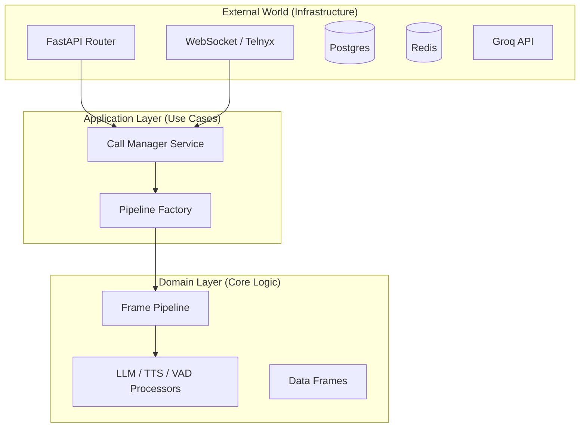

# Auditoría de Calidad y Estándares de Industria (Codebase Audit)

> **Veredicto Ejecutivo**: El proyecto tiene una funcionalidad sólida (funciona), pero su arquitectura es "amateur" y monolítica en puntos críticos. Para llegar al nivel de "Líder de Industria" (como piden empresas SaaS de alto nivel), se requiere una refactorización estructural inmediata.

---

## 1. Violaciones de Estándares (Lo que "no se ve bien")

### ❌ A. El Problema del "God Object" (Violación SRP)
**Archivo Crítico**: `app/core/orchestrator.py` (~760 líneas)
Este archivo intenta hacer todo. Es el corazón del sistema, pero está infartado.
- **Transporte**: Maneja WebSockets y codificación de audio.
- **Lógica de Negocio**: Decide cuándo terminar la llamada, actualiza CRM.
- **Construcción**: Inicializa el Pipeline (`_build_pipeline`).
- **Mezcla de Audio**: Contiene lógica de bajo nivel de NumPy (`_mix_audio`).

**Estándar de Industria**: Una clase debe tener **una sola razón para cambiar**.
- Si cambia la API de Telnyx, el Orchestrator cambia.
- Si cambia la lógica de mezcla de audio, el Orchestrator cambia.
- Si cambia el CRM Baserow, el Orchestrator cambia.
Esto es inaceptable para un sistema escalable.

### ❌ B. Estructura de Directorios "Cajón de Sastre"
**Directorio**: `app/core/` (29 archivos)
Contiene desde `config.py` (correcto) hasta `orchestrator.py` (incorrecto), `redis_state.py` (infraestructura), y `tracing.py` (observabilidad).
**Estándar de Industria**: Distinción clara entre **Dominio**, **Infraestructura** y **Aplicación**.

### ❌ C. Patrones de Instanciación Inconsistentes
En `app/services/*.py`, vemos instancias globales al final del archivo:
```python
azure_service = AzureSpeechService() # Singleton global implícito (Anti-patrón)
```
Mientras que en otros lados usamos `ServiceFactory`.
**Riesgo**: Hace que los tests unitarios sean una pesadilla (no se puede mockear fácilmente) y crea problemas en ejecución asíncrona concurrente.

### ❌ D. `main.py` Sobrecargado
El archivo de entrada contiene lógica de migración de base de datos (`subprocess.run`), configuración de Redis y middlewares inline.
**Estándar**: `main.py` debe ser solo el punto de entrada que llama a `create_app()`.

---

## 2. La Arquitectura Objetivo ("Industry Leader")

Proponemos migrar hacia una **Arquitectura Hexagonal (Ports & Adapters)** simplificada.



---

## 3. Plan de Refactorización (Roadmap)

Para arreglar esto **sin romper la funcionalidad**, debemos proceder quirúrgicamente:

### Fase 1: Limpieza del "God Object" (Orchestrator)
1.  **Extraer `AudioTransport`**: Mover toda la lógica de WebSockets y codificación/decodificación a una clase `TelnyxTransport`.
2.  **Extraer `CallLifecycle`**: Mover lógica de CRM y Webhook a un servicio `CallService`.
3.  **Resultado**: El `VoiceOrchestrator` solo coordinará, no hará el trabajo sucio.

### Fase 2: Reorganización de Directorios (Distribution)
Mover archivos para reflejar capas lógicas:
- `app/core/` -> Solo configuración y utilidades base.
- `app/infrastructure/` -> `redis_state.py`, `azure_speech.py`, `telnyx_client`.
- `app/domain/pipeline/` -> Todo lo que está en `app/processors`.

### Fase 3: Standardización de Inyección de Dependencias
Eliminar las instancias globales (`azure_service = ...`). Usar `FastAPI Dependency Injection` o un `Factory` centralizado para todo.

---

## Conclusión
Lo que estás viendo actualmente es un "Prototipo Avanzado". Para convertirlo en un "Producto Enterprise", debemos ejecutar este plan.

¿Deseas comenzar con la **Fase 1 (Desmantelar el Orchestrator)** inmediatamente?
