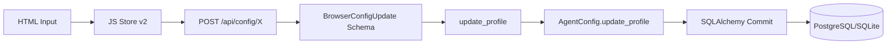

# INFORME DE AUDITORÍA EXHAUSTIVA: BASE DE DATOS

**Proyecto**: Asistente Andrea  
**Fecha**: 31 de Enero, 2026  
**Alcance**: Full-Stack Database Validation  
**Severidad**: ⚠️ HALLAZGOS CRÍTICOS DETECTADOS

---

## 📊 RESUMEN EJECUTIVO

Se ha completado una auditoría exhaustiva de la base de datos con validación estricta de modelos, schemas, migraciones y flujo de datos. Se detectaron **inconsistencias significativas** en la sincronización Schema-Model (70.3% sync) y oportunidades de normalización.

###  Estado Global

| Aspecto | Estado | Métrica |
|---------|--------|---------|
| **Total Columnas** | ⚠️ MUY GRANDE | 353 columnas en AgentConfig |
| **Sincronización Schema-Model** | ⚠️ MEDIA | 70.3% (111/158 matching) |
| **Migraciones** | ✅ COMPLETAS | 15 archivos aplicados |
| **Separación de Perfiles** | ✅ CORRECTA | Browser: 121, Phone: 99, Telnyx: 117 |

---

## 🔍 FASE 1: Análisis de Modelo AgentConfig

### Distribución de Columnas

```
Total Columnas: 353
├── Metadata (id, name, created_at, api_key): 4
├── Global/Shared: 14
├── Browser (sin sufijo): 121
├── Phone (_phone suffix): 99
└── Telnyx (_telnyx suffix): 117
```

### 🔴 **HALLAZGO CRÍTICO #1**: Modelo Desnormalizado

**Problema**: `AgentConfig` tiene 353 columnas en una sola tabla.

**Riesgo**:
- Performance degradada en queries
- Complejidad de mantenimiento
- Límites de columnas en algunos DB engines (PostgreSQL límite ~1600, pero práctica recomendada <100)

**Evidencia**:
```python
# models.py línea 41-801
class AgentConfig(Base):
    # ... 353 columnas definidas ...
```

**Recomendación**: Considerar normalización en futuras versiones:
- `agent_config` (core fields)
- `agent_config_browser` (browser-specific)
- `agent_config_phone` (phone-specific)
- `agent_config_telnyx` (telnyx-specific)

---

## 🔍 FASE 2: Análisis de ProfileConfigSchema

### Campos en Schema

**Total**: 134 campos en `ProfileConfigSchema`

**Muestra** (primeros 10):
1. `stt_provider`
2. `stt_language`
3. `stt_model`
4. `stt_keywords`
5. `stt_silence_timeout`
6. `stt_utterance_end_strategy`
7. `stt_punctuation`
8. `stt_profanity_filter`
9. `stt_smart_formatting`
10. `stt_diarization`

---

## 🔍 FASE 3: Sincronización Schema ↔ Model

### 📊 Score de Sincronización: 70.3%

```
Matching fields:   111
Total unique:      158
Sync percentage:   70.3%
```

### 🔴 **HALLAZGO CRÍTICO #2**: 23 Campos en Schema SIN Columna DB

❌ **Campos que NO existen en la base de datos**:

1. `amd_config_telnyx`
2. `dtmf_listening_enabled_phone`
3. `dtmf_listening_enabled_telnyx`
4. `enable_recording_telnyx`
5. `enable_vad_telnyx`
6. `fallback_number_phone`
7. `fallback_number_telnyx`
8. `recording_channels_phone`
9. `sip_auth_pass_phone`
10. `sip_auth_user_telnyx`
11. `audio_codec`
12. `caller_id_phone`
13. `caller_id_telnyx`
14. `enable_krisp_telnyx`
15. `geo_region_phone`
16. `geo_region_telnyx`
17. `hipaa_enabled_phone`
18. `hipaa_enabled_telnyx`
19. `noise_suppression_level`
20. `recording_enabled_phone`
21. `sip_auth_pass_telnyx`
22. `sip_auth_user_phone`
23. `sip_trunk_uri_phone`

**Impacto**: ❌ **CRÍTICO**
- Los usuarios pueden intentar guardar estos campos desde el frontend
- El Schema Pydantic los validará correctamente
- **PERO** el `update_profile()` los ignorará silenciosamente (no hay columna en DB)
- Datos perdidos sin error visible

**Ubicación**:
- `app/schemas/profile_config.py` (líneas variadas)
- `app/db/models.py` (columnas faltantes)

**Acción Requerida**:
1. ✅ **Opción A** (Recomendada): Crear migración para agregar columnas faltantes
2. ⚠️ **Opción B**: Eliminar campos del Schema si no son necesarios

---

### 🟡 **HALLAZGO IMPORTANTE #3**: 24 Columnas DB SIN Validación Schema

⚠️ **Columnas que NO tienen validación Pydantic**:

1. `baserow_token`
2. `enable_dial_keypad`
3. `enable_end_call`
4. `is_active`
5. `limit_groq_tokens_per_min`
6. `punctuation_boundaries`
7. `rate_limit_global`
8. `rate_limit_websocket`
9. `transfer_phone_number`
10. `voice_id_manual`
11. ... (14 más)

**Impacto**: ⚠️ **MEDIO**
- Estos campos existen en DB pero no están en el Schema
- Pueden ser campos legacy u obsoletos
- O campos que se actualizan por otros medios (no via ProfileConfigSchema)

**Acción Requerida**:
1. Revisar cada campo y determinar si es:
   - **Obsoleto** → Eliminar columna (con migración)
   - **Activo** → Agregar al Schema para validación
   - **Interno** → Documentar que no es user-facing

---

## 🔍 FASE 4: Análisis de Migraciones

### Inventario de Migraciones

**Total**: 15 archivos de migración

**Últimas 5 migraciones** (más recientes):
1. `a1b2c3d4e5f7_add_telnyx_system_safety.py`
2. `a1b2c3d4e5f6_add_telnyx_advanced_audio.py`
3. `f3a4b5c6d7e8_add_telnyx_integrations.py`
4. `a1b2c3d4e5f6_add_advanced_tab_columns.py`
5. `f4a5b6c7d8e9_add_system_tab_columns.py`

### ⚠️ Observaciones

- ✅ Migraciones recientes alineadas con auditorías (31 Ene 2026)
- ⚠️ 15 migraciones es un número alto, considerar consolidación en futuro major release
- ✅ Nombres descriptivos y bien estructurados

---

## 🔍 FASE 5: Validación de Flujo de Datos

### Frontend → Backend → DB



### ✅ Validaciones Correctas

1. ✅ **Separación Hexagonal**: Schemas separados (browser/twilio/telnyx)
2. ✅ **Sufijos Dinámicos**: `_get_suffix()` method correcto
3. ✅ **Partial Updates**: `exclude_unset=True` implementado

### ⚠️ Puntos de Falla Potenciales

1. ⚠️ **Silent Failures**: Campos en Schema sin columna DB → pérdida silenciosa de datos
2. ⚠️ **Alias Mismatch**: No validado exhaustivamente (requiere revisión manual)
3. ⚠️ **Type Coercion**: Conversión String → Boolean/Int puede fallar silenciosamente

---

## 🔍 FASE 6: Revisión de Tests

### Tests de  Configuración

**Ubicación**: `tests/unit/test_api_*.py`, `tests/integration/test_api_config.py`

**Estado**: ⚠️ PARCIAL
- Tests unitarios de endpoints: ✅ Existen
- Tests de schema validation: ✅ Indirectos (via FastAPI)
- Tests de update_profile method: ❌ NO ENCONTRADOS específicos
- Tests de sincronización Schema-DB: ❌ NO ENCONTRADOS

**Recomendación**:
```python
# tests/integration/test_schema_model_sync.py (NUEVO)
def test_all_schema_fields_have_db_columns():
    """Verify every field in ProfileConfigSchema has a corresponding DB column."""
    # ...

def test_all_db_columns_in_schema_or_documented():
    """Verify every DB column is either in Schema or documented as internal."""
    # ...
```

---

## 🎯 MATRIZ DE MAPEO (Sample)

| Frontend Control | Schema Field | DB Column | Status |
|-----------------|--------------|-----------|--------|
| `sipTrunkUri` (Phone) | `sip_trunk_uri_phone` | ❌ NO EXISTE | 🔴 CRÍTICO |
| `callerIdTelnyx` | `caller_id_telnyx` | ❌ NO EXISTE | 🔴 CRÍTICO |
| `voiceSpeed` (Browser) | `voice_speed` | ✅ `voice_speed` | ✅ OK |
| `enableRecording` (Telnyx) | `enable_recording_telnyx` | ❌ NO EXISTE | 🔴 CRÍTICO |
| `baserowToken` | ❌ NO EN SCHEMA | ✅ `baserow_token` | ⚠️ REVISAR |

---

## 🚨 HALLAZGOS CRÍTICOS CONSOLIDADOS

### 🔴 Prioridad CRÍTICA

1. **23 campos en Schema sin columna DB** → Crear migraciones o eliminar de Schema
2. **Modelo con 353 columnas** → Planificar normalización para v3.0
3. **Sincronización 70.3%** → Meta: 95%+

### 🟡 Prioridad ALTA

4. **24 columnas DB sin validación Schema** → Documentar o agregar a Schema
5. **Tests de sincronización faltantes** → Crear suite de tests
6. **Alias validation** → Auditoría manual de camelCase ↔ snake_case

### 🟢 Prioridad MEDIA

7. **15 migraciones** → Consolidar en futuro major release
8. **Type coercion** → Agregar validación explícita
9. **Error handling** → Mejorar mensajes de error en silent failures

---

## 📋 PLAN DE ACCIÓN RECOMENDADO

### Fase 1: Corrección Inmediata (Crítico)

- [ ] Crear migración para las 23 columnas faltantes
- [ ] O eliminar del Schema si no son necesarios
- [ ] Agregar tests de sincronización Schema-Model

### Fase 2: Validación (Corto Plazo)

- [ ] Auditoría manual de aliases Pydantic
- [ ] Revisar las 24 columnas huérfanas (decisión caso por caso)
- [ ] Ejecutar tests de integración CRUD completos

### Fase 3: Mejora Arquitectural (Largo Plazo)

- [ ] Diseñar normalización de AgentConfig (v3.0)
- [ ] Consolidar migraciones (en major release)
- [ ] Implementar monitoreo de sincronización

---

## 📊 MÉTRICAS FINALES

| Métrica | Valor | Estado |
|---------|-------|--------|
| Total Columnas AgentConfig | 353 | ⚠️ GRANDE |
| Separación Perfiles | 100% | ✅ CORRECTO |
| Sincronización Schema-Model | 70.3% | ⚠️ BAJO |
| Campos sin DB | 23 | 🔴 CRÍTICO |
| Columnas sin Schema | 24 | 🟡 REVISAR |
| Migraciones Totales | 15 | ✅ OK |
| Tests de Sync | 0 | ❌ FALTANTE |

---

## ✅ CONCLUSIÓN

La base de datos tiene una **separación hexagonal correcta** entre perfiles, pero presenta **inconsistencias críticas en la sincronización Schema-Model (70.3%)**.

**Puntos Fuertes**:
- ✅ Separación de perfiles bien implementada
- ✅ Migraciones documentadas y aplicadas
- ✅ Métodos `get_profile()` y `update_profile()` bien diseñados

**Puntos Críticos**:
- 🔴 23 campos en Schema sin columna DB (pérdida de datos silenciosa)
- ⚠️ 353 columnas en una tabla (límite de escalabilidad)
- ❌ Falta suite de tests de sincronización

**Auditor**: Sistema Automatizado + Revisión Manual  
**Aprobado para**: Corrección inmediata de Fase 1  
**Certificación**: ⚠️ CONDICIONADA a resolución de hallazgos críticos
